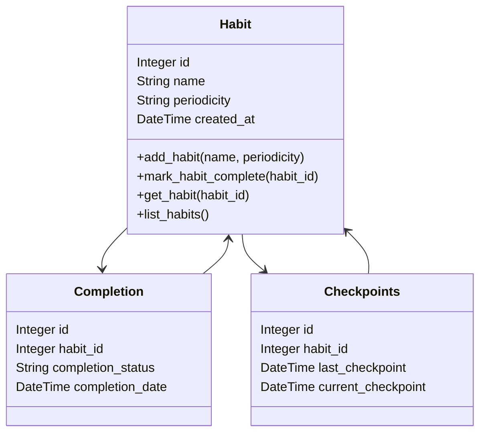
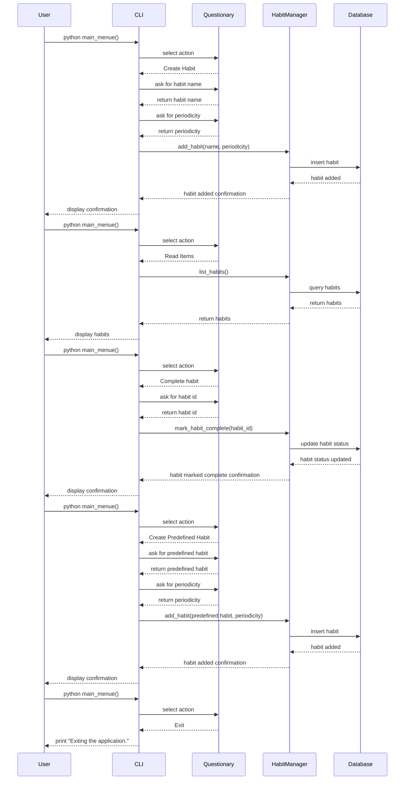
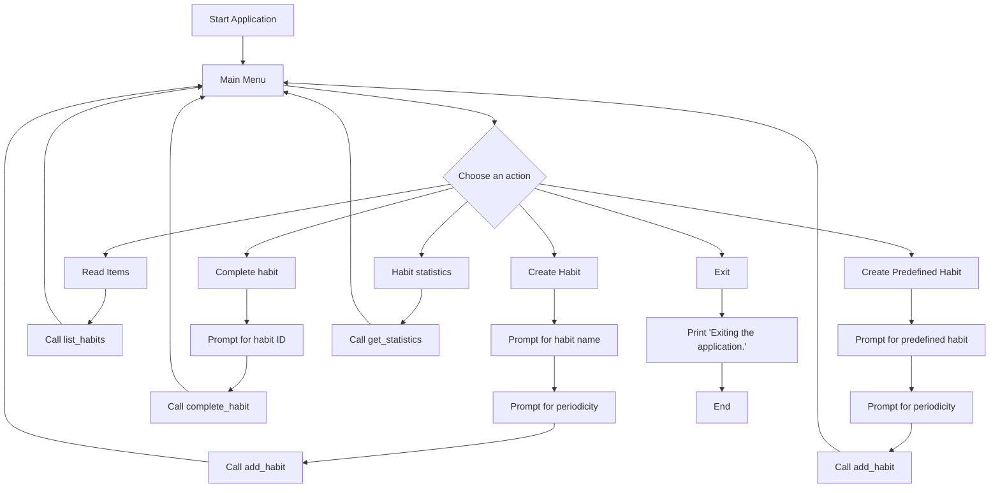

# Habit Tracker

Habit Tracker is a command-line application to help users manage their habits. Users can create, read, complete, and manage habits with predefined options. The application uses SQLAlchemy for database interactions and Questionary for a user-friendly CLI interface.

## Features

- Create new habits with specified periodicity (daily or weekly)
- List all existing habits
- Mark habits as complete
- Create predefined habits
- Interactive CLI interface

## Requirements

- Python 3.7 or later
- SQLAlchemy
- Click
- Questionary

## Installation

1. Clone the repository:
   ```sh
   git clone https://github.com/XeniaJun/habit-tracker.git
   cd habit-tracker
   ```
   
2. Create a virtual environment and activate it:
    ```sh
    python3 -m venv venv
    source venv/bin/activate  # On Windows use `venv\Scripts\activate`
   ```
3. Install the dependencies:
    ```sh
    pip install -r requirements.txt
   ```
   
## Usage

Run the main menu to start the application:
```sh
    python main.py
```

## Class Diagram



## Code Structure
- **main.py**: The main entry point for the CLI application.
- **Habit.py**: Contains the HabitManager class for managing habits.
- **db/DatabaseModule.py**: Database models and session setup.


## Sequence Diagramm


## Flow Chart
